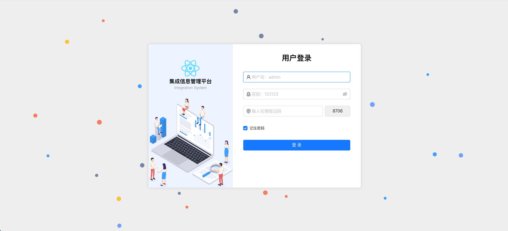
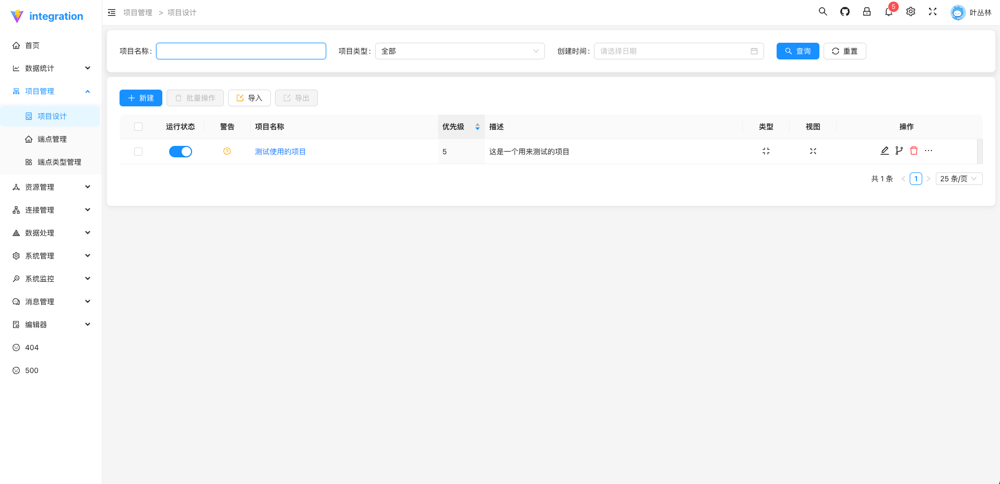
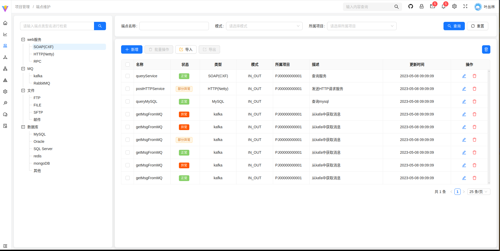

# 集成信息管理平台，用于将多种协议、多种系统进行耦合，通过配置服务并发布，可做到让不同厂商的系统进行最简化的系统对接

# 框架技术： 
    react@latest  
    antd@latest 
    vite@5.3.4  
    sass@1.77.8
    react-router-dom@6.26.0
    react-dom@18.3.1
    axios@1.7.3
# 注意
    其中对axios进行了二次封装，其前后台交互的数据是json，并将数据进行了加密处理，发送到后端，后端项目参考
    https://github.com/yecongling/integration

# 支持丰富的交互协议，http、soap、RPC、hl7(后续支持)、file 等等，其包含的功能大部分由 apache camel 中的组件所支持，也可自行扩充其中的组件

# 首页

# 项目维护模块

项目维护主要是为了管理项目，方便进行项目配置，项目配置主要包含项目基本信息、项目服务、项目服务接口、项目服务接口参数、项目服务接口参数配置等

# 端点维护模块

端点主要就是每一个服务的开头或者结尾或者中间交互的，其作用就类似于接口，可以供外部调用，也可以调用外部，端点类型有很多，有队列服务的，有http服务的，有soap服务的，还有rpc服务的，有hl7服务的，有文件服务的，有队列服务的，有数据库服务的，有redis服务的

